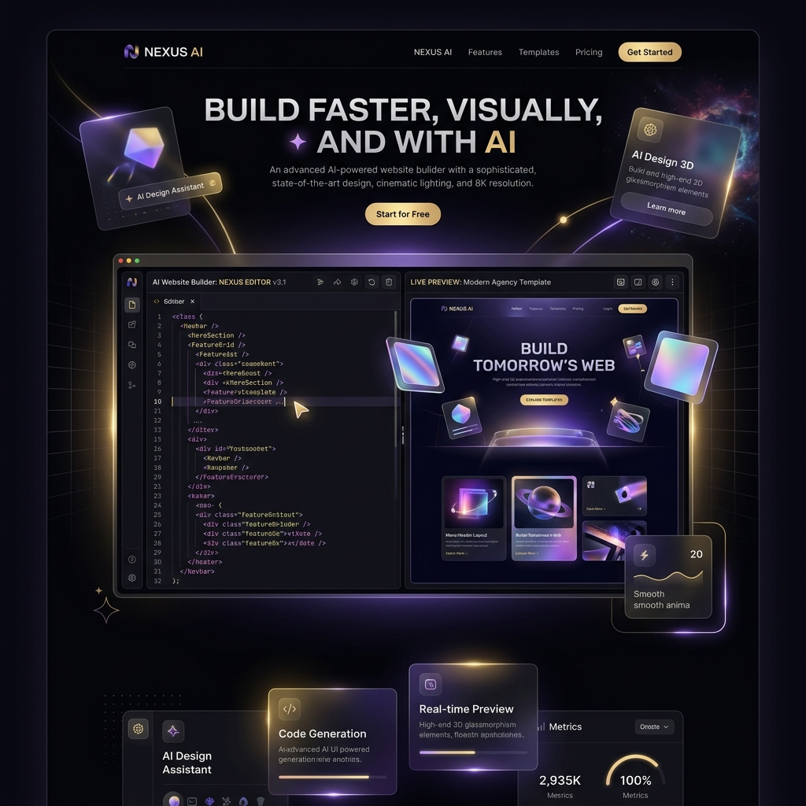
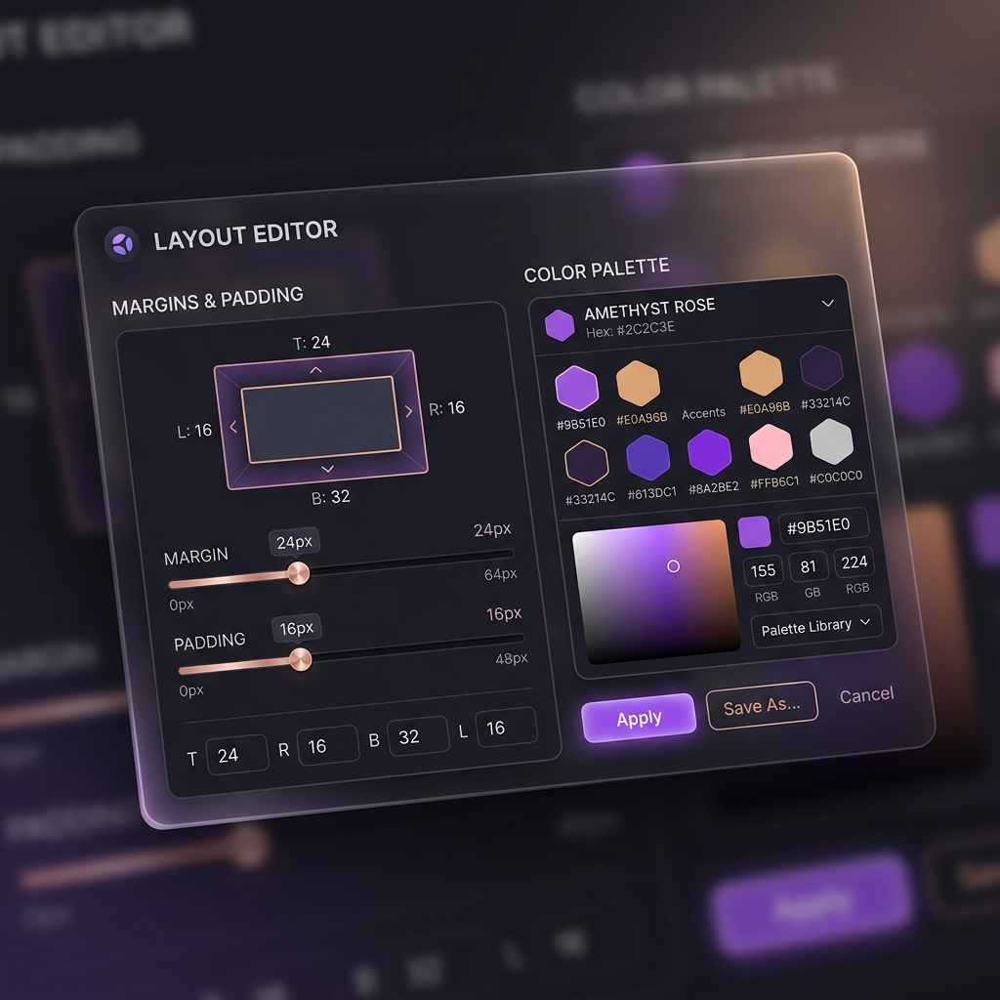
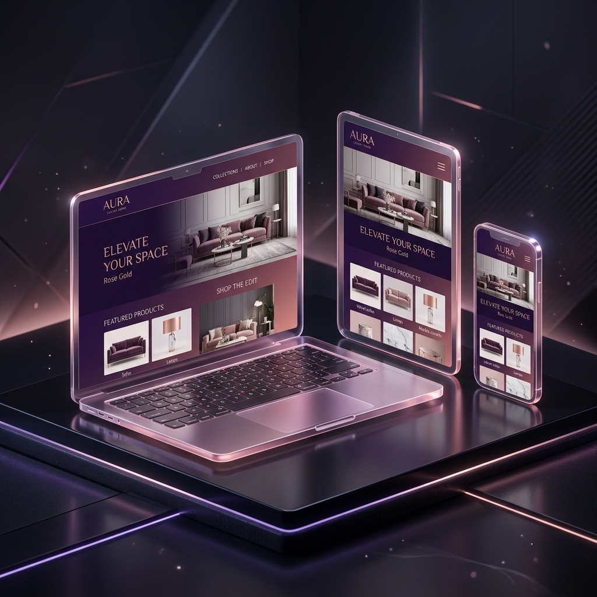

<p align="center">
  
</p>

<h1 align="center">🔮 AI-Powered Website Builder</h1>

<p align="center">
  <b>Designed & Built with ⚡ by Abraham Paul Sanhith</b>
</p>

<p align="center"><i>An Ultra-Premium, Luxury Studio-Tier SaaS Platform to Instant-Draft, Style, and Compile React Applications via Stateless AI Pipelines.</i></p>

<p align="center">
  
  
  
  
</p>

---

## 🎨 Visual Identity & Luxury Theme

This platform has been entirely redesigned away from standard blue cyberpunk templates. It introduces a **bespoke luxury studio aesthetic** featuring:
* **Matte Obsidian Backdrop:** Deep violet-black layouts optimized for developers (`bg-[#06030b]`).
* **Metallic Rose Gold & Copper Accents:** Sophisticated UI highlights (`from-amber-200 via-rose-300 to-violet-400`).
* **Glowing Amethyst Violet Indicators:** State-of-the-art interactive feedback.

---

## 📸 Platform Capabilities

<div align="center">
  <table border="0" cellspacing="0" cellpadding="4">
    <tr>
      <td align="center" width="50%">
        
        <br/>
        <sub><b>✨ Real-time Style Controls Panel</b></sub>
      </td>
      <td align="center" width="50%">
        
        <br/>
        <sub><b>📱 Multi-Device Adaptive Preview Frame</b></sub>
      </td>
    </tr>
  </table>
</div>

---

## 🚀 Key Architectural Overhauls

1. **Stateless Streaming Pipelines:** Rewritten to use stateless `generateContentStream` configurations with strict role alternating structures. This prevents token explosions and completes requests under **Vercel's 15-second serverless execution limits**!
2. **Crash-Proof Sandbox Compilers:** Upgraded section loaders, safely parsing component IDs and utilizing SafeIcons to prevent Sandpack compilation failures.
3. **Double-Pane Workspace Grid:** Maximized editor responsiveness by collapsing Outline Navigators and Chat panels into a tabbed layout, allowing the preview canvas full screen scaling.

---

## 🛠️ Technology Stack

* **Frontend Framework:** Next.js 15 (React 18)
* **Design Utilities:** Tailwind CSS & Lucide Icons
* **Cloud Database & Backend:** Convex Database (Real-time schema sync)
* **Code Compiler Sandbox:** CodeSandbox Sandpack Engine
* **AI Processing Model:** Gemini 2.5 Flash (`gemini-2.5-flash`)

---

## 💻 Local Setup Instructions

1. **Clone the Repository:**
   ```bash
   git clone https://github.com/paul2k724-web/aiwebsitemaker.git
   cd aiwebsitemaker
   ```

2. **Install Dependencies:**
   ```bash
   npm install
   ```

3. **Configure Environment Variables:**
   Create a `.env.local` file in your root directory and input your API keys:
   ```env
   NEXT_PUBLIC_GEMINI_API_KEY=your_gemini_api_key_here
   NEXT_PUBLIC_CONVEX_URL=your_convex_cloud_url_here
   CONVEX_DEPLOYMENT=dev:your_convex_deployment_id
   ```

4. **Launch Local Servers:**
   ```bash
   npm run dev
   ```
   Open **`http://localhost:3000`** in your browser.

---

## 🌐 Production Deployment (Vercel)

This application is fully optimized for one-click hosting on Vercel:
1. Log in to [Vercel](https://vercel.com/) via GitHub.
2. Import the `aiwebsitemaker` repository.
3. Add the environment variables (`NEXT_PUBLIC_GEMINI_API_KEY`, `NEXT_PUBLIC_CONVEX_URL`, and `CONVEX_DEPLOYMENT`) into the dashboard configuration settings.
4. Click **Deploy**!

---

<p align="center">
  <sub>Designed & Built with ⚡ by <b>Abraham Paul Sanhith</b> &copy; 2026</sub>
</p>
